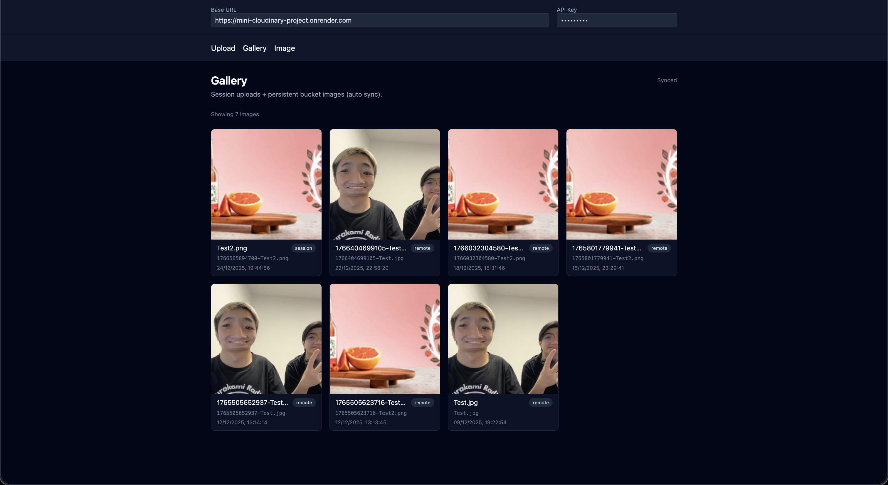
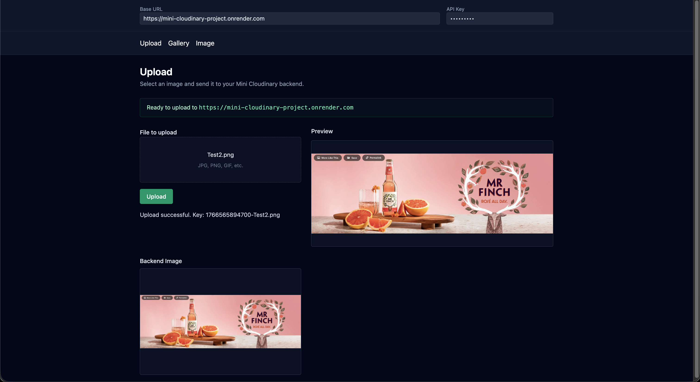
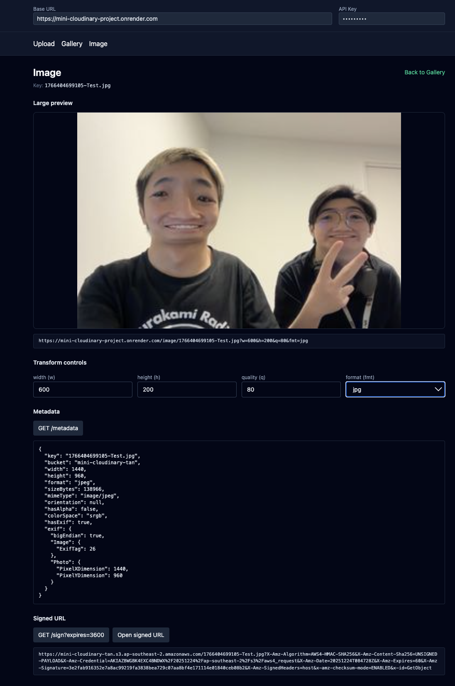

# Mini Cloudinary Dashboard

A Cloudinary-inspired image management dashboard.

This repository contains the **frontend** (React + Vite) for uploading images, browsing a gallery, previewing transformations, inspecting metadata, and generating signed URLs via a separate backend API.

**Live demo (frontend):** https://cloudinary-dashboard-project.vercel.app/

## 🎥 Video Demo

[](https://youtu.be/UXzqjrTFrKI)

In this demo, I walk through the full frontend dashboard (upload, gallery, image details, transformations, metadata, signed URLs) and show the S3 bucket updating in real time.

## 🔗 Backend Links

- **Backend Repository (GitHub):**  
  https://github.com/tanbeoi/Mini-Cloudinary-Project

- **Backend Deployment (Render):**  
  https://mini-cloudinary-project.onrender.com

- **API Documentation (Swagger):**  
  https://mini-cloudinary-project.onrender.com/docs/

## 🧠 Project Overview

This is a mini Cloudinary-style system built to understand how modern image services work end-to-end:

- A backend API handles uploads, transformations, metadata, and signing
- This frontend dashboard provides the UI for interacting with those features
- Images are served through backend routes (not directly from object storage) to enable dynamic transforms

The focus is architecture, data flow, and real-world frontend/backend integration.

## ✨ Features

- Image upload via protected backend endpoint
- On-the-fly transformations via query parameters:
  - Resize (`w`, `h`)
  - Quality (`q`)
  - Format (`jpg`, `png`, `webp`, `avif`)
- Gallery view:
  - Session-based uploads for instant feedback
  - Persistent gallery synced from cloud storage
  - Auto-polling to keep the gallery up-to-date
- Image details:
  - Large preview with live transform controls
  - Metadata inspection
  - Signed URL generation for private access

## 📸 Screenshots

### Gallery


### Upload


### Image Details + Transform Controls


## 🧱 Tech Stack

- React (Vite)
- Tailwind CSS
- React Router
- Zustand

## 🔌 API Expectations

This frontend expects a backend with routes like:

- `POST /upload` (protected)
- `GET /image/:key` (public, supports transforms via query string)
- `GET /metadata/:key` (protected)
- `GET /sign/:key` (protected)
- `GET /list` (protected)

Some routes are protected using an `x-api-key` header. This is not production-grade auth; it’s meant to demonstrate request protection and client handling patterns.

## 🔗 Integration (Frontend ↔ Backend)

The frontend connects to the **Mini Cloudinary API** using:

- **Base URL**: configured via `VITE_DEFAULT_BASE_URL` (or changed in the UI if your app supports switching)
- **API key**: entered in the dashboard UI and sent as the `x-api-key` header for protected routes

## ⚙️ Configuration

### 🧩 Frontend environment variables

Create a `.env` file in the project root:

```env
VITE_DEFAULT_BASE_URL=https://mini-cloudinary-project.onrender.com
```

`VITE_DEFAULT_BASE_URL` sets the default backend URL on first load.
The API key is entered in the dashboard UI.

## 🚀 Running Locally

### ✅ Prerequisites

- Node.js 18+ recommended

### 📦 Install

```bash
npm install
```

### 🧪 Start dev server

```bash
npm run dev
```

### 🏗️ Build

```bash
npm run build
```

### 👀 Preview production build

```bash
npm run preview
```

## 🗂️ Project Structure

- `src/pages/` – route pages (`Gallery`, `Image`, `Upload`)
- `src/components/` – shared UI components
- `src/store/` – Zustand stores
- `src/api/` – API client helpers

## 📌 Future Improvements

- Real authentication (JWT / OAuth)
- Pagination for large buckets
- Drag-and-drop uploads
- Saved transformation presets
- Better error/loading states

## 👤 Author

Built by Tan Pham as a learning-driven full-stack project.
